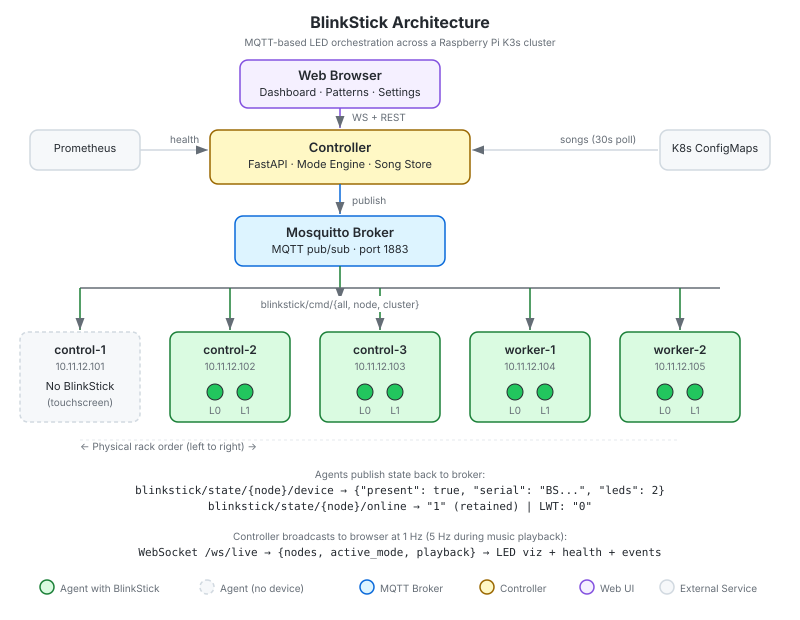

# BlinkStick

LED orchestration for [BlinkStick](https://www.blinkstick.com/) USB devices across a Kubernetes cluster. Deploy MQTT agents as a DaemonSet, and every node with a BlinkStick becomes a programmable RGB LED — controllable individually, by group, or cluster-wide in a single command. The controller discovers nodes and LED counts automatically; the system scales from a 2-node test bench to a full rack.

Built for Raspberry Pi K3s clusters on ARM64, but works on any K8s distribution where nodes have USB-attached BlinkStick devices.



> *The diagram above shows the author's 5-node RPi cluster. Your deployment may have fewer or more nodes — the system adapts automatically.*

## How It Works

1. **Agent** (DaemonSet) runs on every node, discovers the local BlinkStick via USB, and subscribes to MQTT commands
2. **Mosquitto** (Deployment) brokers MQTT messages between the controller and agents
3. **Controller** (Deployment) queries Prometheus for cluster health, translates it into LED colors, serves a web dashboard, and plays music patterns synchronized across nodes

Agents publish their device state (present, serial, LED count) to MQTT. The controller discovers nodes dynamically — no hardcoded node list. Add a node with a BlinkStick, deploy the agent, and the controller picks it up on the next tick.

## Web Dashboard

The controller serves a web UI at the ingress root, designed for both an 800x480 Pi touchscreen and desktop browsers.

**Five pages**: Dashboard (live LED visualization), Music (song library + presets), Modes (mode switcher), Direct (per-node color control), Settings (clock sync + system info).

**Five themes**: System, Light, Dark, Midnight, Terminal — persisted to localStorage, selectable from the nav bar.

**Live updates**: WebSocket at `/ws/live` pushes node state, health, and playback info at up to 10 updates/sec with auto-reconnect.

## Supported Devices

Any [BlinkStick](https://www.blinkstick.com/) USB device works. LED count is read from each device automatically.

| Device | LEDs | Tested |
|--------|------|--------|
| BlinkStick Nano | 2 | Yes (primary target) |
| BlinkStick Strip | 8 | Should work |
| BlinkStick Pro | Up to 64 | Should work |

## Quick Start

### Prerequisites

- A Kubernetes cluster (K3s, k3d, or any distro) with nodes that have BlinkStick USB devices
- ARM64 or AMD64 nodes (images built for ARM64; rebuild for other architectures)
- A Prometheus stack (for status mode health visualization)
- USB access: host udev rule `SUBSYSTEM=="usb", ATTR{idVendor}=="20a0", MODE="0666"` recommended

### Deploy

The system spans two repos:
- **This repo** (`k8s-blinkstick`): Application code, Dockerfiles, CI
- **Manifests repo**: K8s DaemonSet, Deployments, Mosquitto, ConfigMaps

```bash
# Push to main triggers CI → builds ARM64 images → pushes to GHCR
git push origin main

# Apply manifests (or let ArgoCD/Flux handle it)
kubectl apply -k path/to/blinkstick-manifests/
```

### Verify

```bash
# Check pods
kubectl get pods -n blinkstick

# Open the dashboard
open http://<controller-ingress>/

# Check API
curl http://<controller-ingress>/api/v1/nodes     # discovered agents
curl http://<controller-ingress>/api/v1/status    # health + LED state
curl http://<controller-ingress>/api/v1/presets   # built-in patterns

# Play a preset
curl -X POST http://<controller-ingress>/api/v1/presets/chase/play
```

## Music Mode

Play synchronized LED patterns across the cluster using beat sheets — YAML files that define colors, timing, and structure.

### Beat Sheet Format

```yaml
apiVersion: blinkstick.octolet.int/v1
kind: BeatSheet
metadata:
  name: my-song
  title: "My Song"
timing:
  bpm: 120
  loop: false
on_end: status
palette:
  R: "#FF0000"
  G: "#00FF00"
  _: "#000000"
node_order:
  - node-a
  - node-b
sections:
  chorus:
    - "RG"
    - "GR"
beats:
  - "GG"
  - {section: "chorus"}
  - {repeat: "RR", count: 4}
  - {colors: "GG", hold: 2}
```

Each character in a beat string maps to a palette color. String length matches `node_order` length (one character per node). Sections, repeats, and holds expand into a flat beat list. The controller pre-loads the full timetable to each agent in a single MQTT message — zero network traffic during playback.

### NTP Clock Sync

Before playback, the controller checks clock skew across all agents:
- **< 50ms**: proceed normally
- **50-200ms**: warn in the API response
- **> 200ms**: block playback with an error

Agents execute beats from their NTP-synced wall clocks — the controller sends `start_at` as a future unix timestamp and each agent counts beats independently.

### Built-in Presets

Five patterns available instantly, no YAML required:

| Preset | Description |
|--------|-------------|
| `chase` | Light sweeps left to right |
| `alternate` | Odd and even nodes toggle |
| `rainbow` | Rotating color wheel |
| `flash` | All on, all off strobe |
| `police` | Red and blue alternating |

Play via API: `POST /api/v1/presets/{name}/play` with optional `bpm`, `color`, `color2` in the body.

### Song Management

Songs are stored as Kubernetes ConfigMaps with the label `blinkstick.octolet.int/type: song`. The controller polls for changes every 30 seconds and loads new songs automatically.

- **Git-synced**: add a ConfigMap to your manifests repo, ArgoCD deploys it
- **Runtime uploads**: POST YAML to `/api/v1/songs`, stored as a ConfigMap labeled `source: runtime`
- **Export**: GET `/api/v1/songs/{name}/export` returns raw YAML

## Command Reference

Commands are JSON payloads published to MQTT topics.

### Topics

| Topic | Scope |
|-------|-------|
| `blinkstick/cmd/all` | Broadcast — same command to all agents |
| `blinkstick/cmd/{node-name}` | Single node |
| `blinkstick/cmd/cluster` | Cluster-wide — different colors per node in one message |

### Single Node / Broadcast

```json
{
  "action": "set",
  "leds": [
    {"index": 0, "r": 0, "g": 255, "b": 0},
    {"index": 1, "r": 0, "g": 0, "b": 255}
  ],
  "effect": "solid",
  "params": {}
}
```

Omitting an LED index from the array leaves that LED unchanged.

### Cluster-Wide

Address every node independently in a single message:

```json
{
  "action": "set",
  "nodes": {
    "node-a": [{"index": 0, "r": 255, "g": 0, "b": 0}, {"index": 1, "r": 0, "g": 0, "b": 255}],
    "node-b": [{"index": 0, "r": 0, "g": 255, "b": 0}, {"index": 1, "r": 255, "g": 255, "b": 0}]
  },
  "effect": "solid",
  "params": {}
}
```

Each agent extracts only its own node's LEDs. Nodes not in the dict are unaffected. Effect and params are global across the message.

### Common Operations

| Want | How |
|------|-----|
| All LEDs one color | `cmd/all` + both indexes |
| All LEDs off | `cmd/all` + `{"action":"off"}` |
| One side of all devices | `cmd/all` + single index in leds array |
| One specific node | `cmd/{node-name}` |
| Every node different | `cmd/cluster` with per-node leds in `nodes` dict |

## Effects

| Effect | Params | Behavior |
|--------|--------|----------|
| `solid` | — | Set color and hold |
| `pulse` | `duration` (ms, default 1000), `steps` (default 50), `repeats` (0 = infinite) | Fade up and down |
| `blink` | `delay` (ms, default 500), `repeats` (0 = infinite) | Toggle on/off |
| `morph` | `duration` (ms, default 1000), `steps` (default 50) | Transition from current color to target |
| `off` | — | Turn off |

All animations are cancellable — sending a new command immediately preempts the running effect.

## Status Mode

When the controller runs in status mode, it polls Prometheus and maps cluster health to LED visualizations:

| State | Color | Effect | Meaning |
|-------|-------|--------|---------|
| Healthy | Green | Breathing pulse (3s) | All systems nominal |
| Warning | Amber | Solid | CPU > 70%, memory > 70%, or disk > 80% |
| Critical | Red | Fast blink (500ms) | Node down, not Ready, or resource > 90% |
| Agent offline | Dim blue | Solid | MQTT agent disconnected |

The visualization is readable from across the room — color tells you *what*, effect tells you *how urgent*.

## REST API

| Method | Path | Description |
|--------|------|-------------|
| GET | `/healthz` | Liveness probe |
| GET | `/readyz` | Readiness probe (503 if MQTT disconnected) |
| GET | `/api/v1/status` | Node health + current LED state |
| GET | `/api/v1/modes` | Available modes (status, direct, music) |
| GET | `/api/v1/modes/active` | Current mode |
| POST | `/api/v1/modes/active` | Switch mode |
| POST | `/api/v1/direct` | Send LED command (direct mode only, else 409) |
| GET | `/api/v1/nodes` | Discovered node registry with clock skew |
| GET | `/api/v1/songs` | List songs from ConfigMap store |
| POST | `/api/v1/songs` | Upload song (YAML or JSON body) |
| GET | `/api/v1/songs/{name}` | Song detail |
| DELETE | `/api/v1/songs/{name}` | Delete song |
| POST | `/api/v1/songs/{name}/play` | Play song |
| POST | `/api/v1/songs/stop` | Stop playback, return to on_end mode |
| GET | `/api/v1/songs/playing` | Current playback state |
| GET | `/api/v1/songs/{name}/export` | Download raw YAML |
| GET | `/api/v1/presets` | List built-in presets |
| POST | `/api/v1/presets/{name}/play` | Play preset with optional bpm/color/color2 |
| WS | `/ws/live` | Live state updates (max 10 connections, 10/sec) |

## Architecture

### Agent

- Runs as a DaemonSet on every node — discovers BlinkStick USB devices automatically
- MQTT callbacks on paho's network thread; USB commands routed through a `queue.Queue` to a dedicated worker thread
- Effects are cancellable loops using direct `set_color()` calls with a `threading.Event` between steps
- Music playback: receives a full timetable via `play_sequence`, dedicated thread ticks through beats at wall-clock intervals
- Graceful degradation: nodes without a BlinkStick publish `{"present": false}` and keep running
- On SIGTERM: sets LEDs to dim amber ("reconciling"), then exits cleanly

### Controller

- FastAPI app with engine running in a separate daemon thread (own asyncio event loop)
- Layered mode engine: background (status), event overlay (Phase 4), foreground (direct, music)
- Dynamic node discovery from MQTT retained messages — no hardcoded node count
- LED count per device read from agent state — works with Nano (2), Strip (8), or Pro (64)
- Song store backed by Kubernetes ConfigMaps with 30s polling
- WebSocket broadcast from engine tick loop via cross-thread dispatch
- In-memory state only — defaults to status mode on restart (fail-safe)

### MQTT Delivery & Music Sync

MQTT delivery is not simultaneous — the broker sends to each subscriber sequentially with a few ms of jitter. For solid colors and simple effects this is invisible. For music playback, the controller pre-loads the full beat timetable to each agent in a single message with a future `start_at` timestamp. Agents execute from their NTP-synced clocks (~5-10ms accuracy), eliminating MQTT jitter entirely — zero network traffic during playback.

## Project Structure

```
agent/
  main.py             # MQTT client, device discovery, heartbeat, shutdown
  driver.py           # Thread-safe BlinkStick wrapper (queue + worker + sequence player)
  effects.py          # Cancellable solid/pulse/blink/morph/off
  config.py           # Environment variable parsing
controller/
  main.py             # FastAPI app, static files, WebSocket, engine thread
  config.py           # Environment variable parsing
  api/
    routes.py         # REST endpoints (status, modes, songs, presets, direct)
    web_routes.py     # HTML page routes (/, /music, /modes, /direct, /settings)
    models.py         # Pydantic models (BeatSheet, NodeHealth, PlaybackState, etc.)
    ws.py             # WebSocket connection manager
  engine/
    mode_engine.py    # Layered state machine with WebSocket broadcast
    status_mode.py    # Prometheus health → LED colors + effects
    music_mode.py     # Beat sheet player, NTP sync, preset generator
    presets.py        # Built-in pattern generators (chase, rainbow, etc.)
  services/
    mqtt_client.py    # MQTT publisher + state subscriber + clock sync
    prometheus.py     # httpx → Prometheus API
    k8s.py            # K8s API client (SA token + httpx + ConfigMap CRUD)
    song_store.py     # ConfigMap-backed song cache with 30s polling
  templates/          # Jinja2 templates (base, dashboard, music, modes, direct, settings)
web/static/
  css/style.css       # 5-theme design system (Playwright-audited)
  js/app.js           # WebSocket client, LED rendering, API helpers
  js/htmx.min.js      # Self-hosted htmx 2.0.4
  fonts/              # Self-hosted JetBrains Mono woff2
Dockerfile.agent      # Agent image (Alpine + blinkstick + pyusb)
Dockerfile.controller # Controller image (Alpine + FastAPI + httpx + pyyaml)
.github/workflows/
  build.yml           # ARM64 GHCR push on merge to main
docs/
  architecture.svg    # System architecture diagram
```

## Version Pinning

All dependencies are pinned to exact versions tested on cluster hardware:

**Agent**

| Dependency | Version |
|-----------|---------|
| Python | 3.12.13 on Alpine 3.22 |
| BlinkStick | git commit `8140b9fa` (master, PR #84 fix) |
| pyusb | 1.3.1 |
| paho-mqtt | 2.1.0 (v2 API) |
| libusb | `libusb-dev` (Alpine — must be `-dev` for pyusb symlink) |

**Controller**

| Dependency | Version |
|-----------|---------|
| Python | 3.12.13 on Alpine 3.22 |
| FastAPI | 0.115.12 |
| starlette | 0.46.2 |
| uvicorn | 0.34.2 |
| httpx | 0.28.1 |
| paho-mqtt | 2.1.0 (v2 API) |
| pydantic | 2.13.5 |
| jinja2 | 3.1.6 |
| pyyaml | 6.0.2 |

## Roadmap

See [TODO.md](TODO.md) for the full phased plan.

- **Phase 1** — Agent + MQTT + Effects (complete)
- **Phase 2** — Controller + Status Mode (complete)
- **Phase 3** — Web UI + Music Mode (complete)
- **Phase 4** — Event Overlays + Creative Modes (Twingate, ArgoCD, Knight Rider)

## License

MIT
